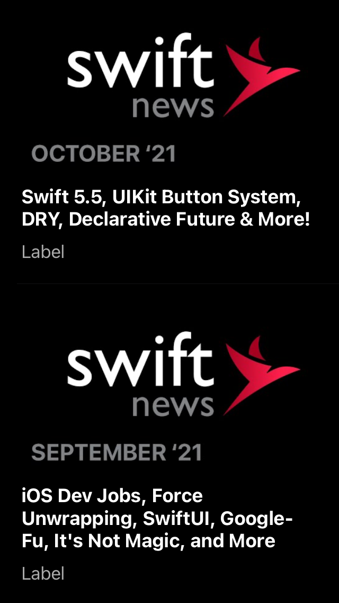
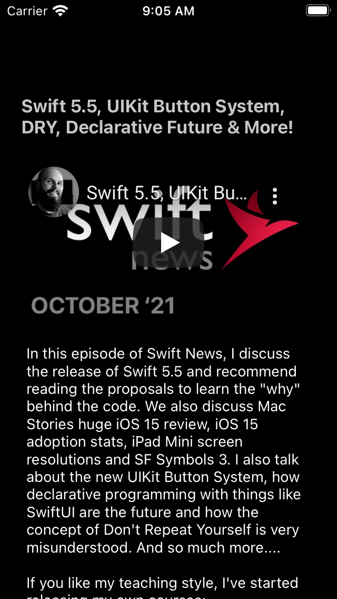

# Youtube Mobile App Clone
Display Youtube playlist for a user and individual video screen
  


## Architecture 
MVC

## Folder Structure
Images<br>
Helpers <br>
NetworkManager <br>
Models <br>
Views <br>
ViewControllers <br>

## Features

<ul class="contains-task-list">
<li class="task-list-item"><input type="checkbox" id="" disabled="" class="task-list-item-checkbox" checked="">Shows a list of video in a playlist</li>
<li class="task-list-item"><input type="checkbox" id="" disabled="" class="task-list-item-checkbox" checked="">Shows individual video on a detail page</li>
<li class="task-list-item"><input type="checkbox" id="" disabled="" class="task-list-item-checkbox" checked="">Video can be played in the individual</li>

</ul>


## Requirements

macOS 10.15 <br>
Xcode 12 <br>
Minimum Deployment Target - iOS 13

macOS 10.15
Xcode 11
iOS 13


## Usage 
Clone the repository:

``` https://github.com/ayodejiayankola/YouTubeMobileClone.git ```


## Getting Started
Clone the Repository<br>
Get the API Key from https://console.cloud.google.com/apis/dashboard<br>
Put API Key in  Constants.swift  file on line 11 inside the Helpers Folder<br>
Put PLAYLIST ID in  Constants.swift  file on line 12 inside the Helpers Folder<br>
BUILD AND RUN YOUR PROJECT ON XCODE
